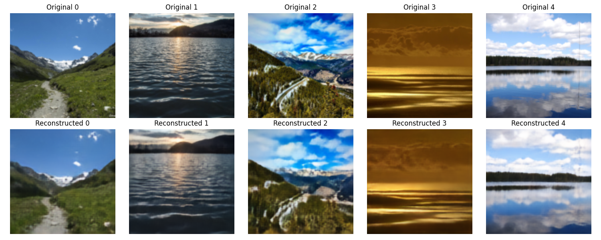
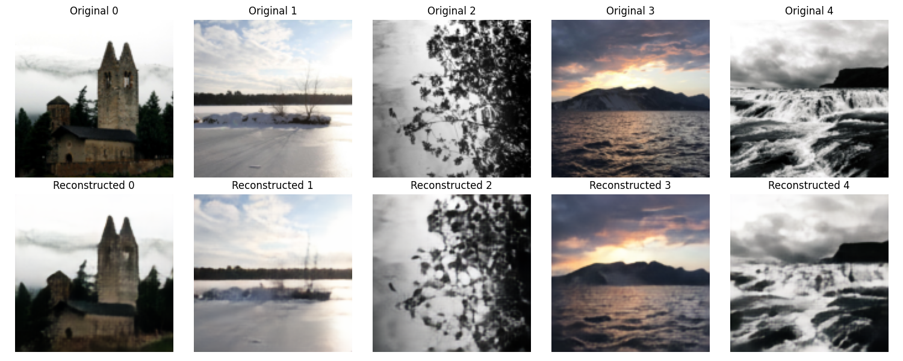

# VAE: Variational Autoencoder

## Project Overview

This project implements a Variational Autoencoder (VAE) from scratch for fun and learning, aiming to experiment with the training process and the architecture itself.

## Features

- Custom-built VAE architecture
- Image reconstruction and generation
- Experiment tracking with Weights & Biases (wandb)
- Trained on $128 \times 128$ images with approximately 12 million parameters
- Trained on about 15,000 images

## ELBO Mathematics

The Evidence Lower Bound (ELBO) for a Variational Autoencoder can be derived as follows:

Given a data point \(x\) and latent variable \(z\), the marginal likelihood can be written as:

\[
\log p(x) = \log \int p(x, z) \, dz
\]

Since the integral is intractable, we approximate it using a variational distribution \(q(z|x)\) and apply Jensen's inequality:

\[
\log p(x) = \log \int q(z|x) \frac{p(x, z)}{q(z|x)} \, dz
\]

By applying Jensen's inequality to the logarithm of the expectation, we obtain:

\[
\log p(x) \geq \mathbb{E}_{q(z|x)} \left[ \log \frac{p(x, z)}{q(z|x)} \right]
\]

This inequality gives the Evidence Lower Bound (ELBO):

\[
\text{ELBO} = \mathbb{E}_{q(z|x)} [\log p(x|z)] - \text{KL}(q(z|x) \parallel p(z))
\]

### Explanation:

1. **Reconstruction Term:**  
   - The first term, \(\mathbb{E}_{q(z|x)} [\log p(x|z)]\), represents the expected log-likelihood of the data given the latent variable, encouraging accurate reconstruction.

2. **Regularization Term:**  
   - The second term, \(- \text{KL}(q(z|x) \parallel p(z))\), is the Kullback–Leibler divergence that regularizes the latent space by minimizing the difference between the approximate posterior \(q(z|x)\) and the prior \(p(z)\).

Thus, the ELBO maximizes both reconstruction accuracy and latent space regularization.

## Model Architecture

The VAE model consists of an encoder and decoder network:

- **Encoder**: Learns a probabilistic latent representation of the input data.
- **Decoder**: Reconstructs the image from the latent representation.
- **Latent Space**: Gaussian distribution with learned mean and variance (typically prior is fixed).

## Training

The training process minimizes the Evidence Lower Bound (ELBO) loss, which is the sum of the reconstruction loss and KL divergence:

$$ \text{loss} = \text{reconstruction loss} + \text{LPIPS loss} + \beta \times \text{KL divergence} $$

In this implementation, the following modifications were made:

### Loss Functions:

- **LPIPS loss** is used for perceptual similarity, capturing perceptual differences effectively.
- **L1 loss** is used for reconstruction as it provides a stronger signal response compared to MSE loss.

### KL Divergence Regularization:

- A **beta** value of 0.02 is used to scale the KL divergence, ensuring balanced regularization without excessive latent compression.

## Results

Here are some results from the model, showing the image reconstruction and generation.

### Input Image and Reconstruction

  

  

